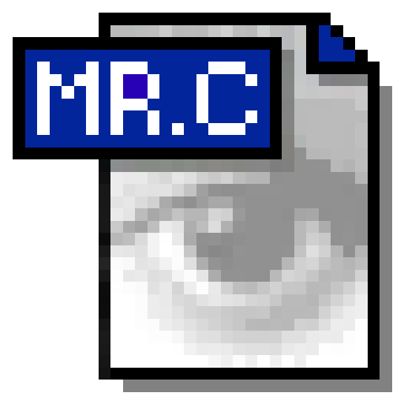

  

<h1 align="center">Image Converter</h1>

  Convert your pictures to another format in a few clicks. 
  Free, simple, and 100% offline. Your pictures never leave your computer.

  <a href="https://github.com/bocchhii/image-converter/releases/latest"><b>⬇ Download for Windows</b></a>

---

## Install (1 minute)

1. Click **Download for Windows** above.
2. On the page that opens, scroll to **Assets** and click **ImageConverter-Setup.exe**.
3. Double-click the downloaded file.
4. If Windows says **"Windows protected your PC"**, click **More info**, then **Run anyway**.
   *(This appears for every app from a small independent developer. The app is safe and works fully offline.)*
5. Click **Next**, then **Install**, then **Finish**.

You'll find **Image Converter** in your Start menu. There's also an optional desktop shortcut during setup.

**To uninstall:** Settings → Apps → Installed apps → Image Converter → Uninstall.

---

## How to use it

1. **Add pictures.** Drag and drop them into the window (folders work too), or click **Add...**
2. **Pick a format** in the **Convert to** box, such as PNG, JPEG or WEBP.
3. **Set the quality** with the slider. This only matters for JPEG, WEBP and similar formats.
4. **Choose where to save.** By default, converted files go next to the originals. Click **Browse...** to pick another folder.
5. Click **Convert**. Done!

Your original pictures are **never changed or deleted**. If a file with the same name already exists, the new one gets `_converted1` added to its name instead of overwriting it.

### Handy tricks

| Do this | To get this |
|---|---|
| Click a picture | Select it |
| **Ctrl** + click | Select several, one by one |
| **Shift** + click | Select a range |
| Click and drag on empty space | Draw a box to select many at once |
| Rest the mouse on a picture | See its type, size and dimensions |
| **Right-click** a picture | **Rename** (the converted file), **Duplicate**, or **Remove** |
| **Delete** key | Remove the selected pictures from the list |

**Rename** only changes the name of the converted file. **Duplicate** adds another copy of the picture to the list, handy for converting one picture to a different name or quality. Nothing is saved until you press **Convert**.

---

## Supported formats

**Convert to:** PNG, JPEG, WEBP, HEIC, AVIF, BMP, GIF, TIFF, ICO, PDF, TGA, PPM, JPEG 2000, DDS, PCX

**Open from:** all the formats above and most other common image types, including iPhone HEIC photos.

---

## Good to know

- **Transparent pictures → JPEG:** JPEG can't be transparent, so the background becomes white.
- **Animated GIFs:** only the first frame is converted.
- **ICO icons:** images larger than 256×256 are shrunk to fit.
- **Not supported:** camera RAW files (CR2, NEF, ARW...) and SVG.
- **Windows only** for now.

---

## Questions

**Is it safe?**
Yes. It runs entirely on your computer and never connects to the internet.

**Why does Windows warn me?**
Windows warns about any app that isn't digitally signed, and signing costs money. Click **More info → Run anyway**.

**Something went wrong.**
Open an [issue](https://github.com/bocchhii/image-converter/issues) and tell me what happened.

---

For developers

Built with Python, Tkinter and Pillow.

**Run from source**

    pip install pillow pillow-heif tkinterdnd2
    python image_converter.py

**Build the installer yourself:** install Python and [Inno Setup](https://jrsoftware.org/isdl.php), then double-click `build.bat`.
The installer appears in `installer_output`.

**Publish a new version:** push a tag like `v1.0.1` (or publish a release with that tag). GitHub Actions builds `ImageConverter-Setup.exe` and attaches it to the release.

